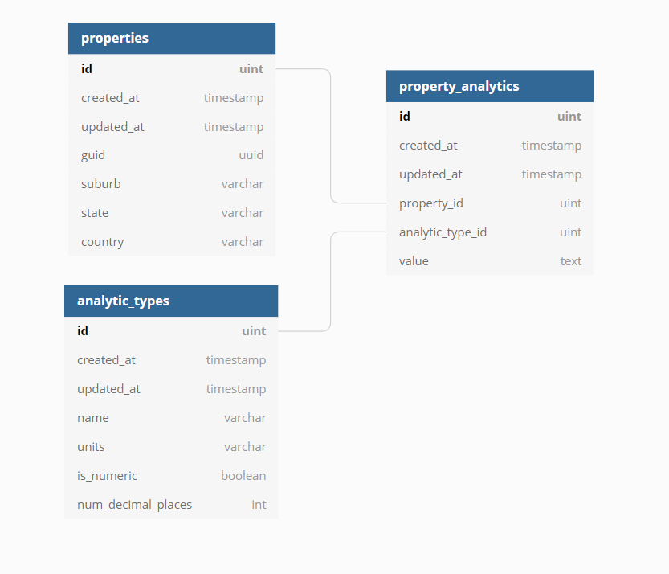

# Coding challenge for Back-End Software Engineer

## Purpose
Aim of these tests are to,

- evaluate your software engineering capability
- evaluate your strength building and managing APIs
- evaluate your strength inserting and querying databases
- benchmark your technical experience and maturity
- understand how you design and implement your solution

## How you will be judged
You will be scored on,

- coding style, comments, and logging (20%)
- design patterns and algorithms (20%)
- solution design - structure and quality (20%)
- use of source control and documentation (20%)
- considerations for CI/CD/DevExp (10%)
- some basic unit/functional/E2E tests (10%)

## Instructions

1. Create a new Laravel Project
2. Setup a database using the ERD diagram below & seed with test data located at [Sample Test Data](resources/BackEndTest_TestData_v1.1.xlsx):
	
3. Create the following API routes

- Add a new property
- Add/Update an analytic to a property
- Get all analytics for an inputted property
- Get a summary of all property analytics for an inputted suburb (min value, max value, median value, percentage properties with a value, percentage properties without a value)
- Get a summary of all property analytics for an inputted state (min value, max value, median value, percentage properties with a value, percentage properties without a value)
- Get a summary of all property analytics for an inputted country (min value, max value, median value, percentage properties with a value, percentage properties without a value)

## Finally
Once you finished the test, either send us a pull request or URL for your Github repository.
